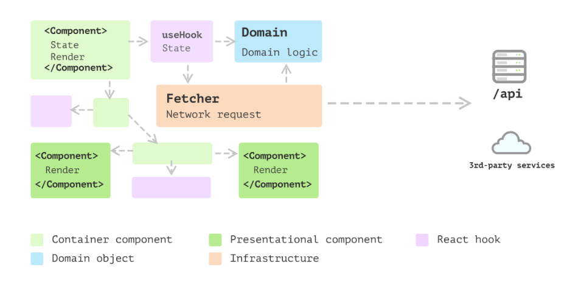

# Manutenção SisEPEI

Aqui estão presentes as estratégias de manutenção que serão implementadas no SisEPEI.

## Back-end

O back-end do SisEPEI está escrito em Java, usando o framework Spring. No momento, está bem dividido em camadas, sendo elas **controle**, **modelo**, **repositório** e **serviço**. Segue o planejamento para as melhorias:

### Implementar Casos de Uso

A lógica da aplicação está centralizada na camada de serviço. Para cada modelo, existe uma classe que implementa as regras de negócio e faz a persistência dos dados. Por exemplo:

```java
public class EditalServico {
	private EditalRepository repositorio;
	private UsuarioRepositorio usuarioRepositorio;
	private JwtService jwtService;

	public Edital criarEdital(EditalDTO edital, String token) throws Exception {
		if(repositorio.existsByTitulo(edital.getTitulo())){
			throw new ValidacaoException("Título já existente");
		}

		var autor = jwtService.extractUserEmail(token);

		Optional<Usuario> coordenador = usuarioRepositorio.findByEmail(autor);

		if (!eCoordenador(edital.getTipo(), coordenador.get())) {
			throw new Exception("Esse coordenador não faz parte desse eixo!");
		}

		Edital editalSalvar = new Edital();
		editalSalvar.setTitulo(edital.getTitulo());
		editalSalvar.setDescricao(edital.getDescricao());
		editalSalvar.setEdital(edital.getEdital());
		editalSalvar.setRequisitos(edital.getRequisitos());
		editalSalvar.setTipo(edital.getTipo());
		editalSalvar.setCoordenador(coordenador.get());
		editalSalvar.setPrazo(edital.getPrazo());

		return repositorio.save(editalSalvar);
	}

	public void removerEdital(Long id, String token) throws Exception {
		Optional<Edital> edital = repositorio.findById(id);
		var autor = jwtService.extractUserEmail(token);
		if(edital.isEmpty()) {
			throw new NaoEncontradoException("Não existe nenhum edital correspondente a esse id");
		}

		if (!Objects.equals(edital.get().getCoordenador().getEmail(), autor)) {
			throw new Exception("Você só pode excluir seus editais");
		}
		repositorio.deleteById(id);
	}
}

```
No código acima, percebe-se que todas as regras de negócio referentes a entidade `Edital` estão centralizadas na classe `EditalServico`. Com a abordagem de Casos de Uso, haveria uma única classe para cada requisito. Segue um exemplo:

```java
public class RemoverEdital() {
    private EditalRepository repositorio;
	private JwtService jwtService;

    public void executar(Long id, String token) throws Exception {
		Optional<Edital> edital = repositorio.findById(id);
		var autor = jwtService.extractUserEmail(token);
		if(edital.isEmpty()) {
			throw new NaoEncontradoException("Não existe nenhum edital correspondente a esse id");
		}

		if (!Objects.equals(edital.get().getCoordenador().getEmail(), autor)) {
			throw new Exception("Você só pode excluir seus editais");
		}
		repositorio.deleteById(id);
	}
}
```
Essa abordagem faz com que a nomenclatura da classe seja extremamente concisa. Só de ler o nome já dá pra saber qual requisito funcional essa classe representa.

### Implementar um handler global de erros

Hoje, os controllers estão apontando as rotas para os serviços. Mas, além disso, eles precisam lidar com as exceções que podem ser disparadas pelos serviços. Sendo obrigatório o uso de um ``try/catch`` e definindo o erro a ser retornado aos clientes. Segue:

```java
public class PerfilApi {
	private PerfilServico perfilServico;

	@PutMapping("/usuarios/{perfil}/{usuarioId}")
	public ResponseEntity<?> adicionarPerfilUsuario(@PathVariable PerfilEnum perfil, @PathVariable Long usuarioId) {
		try {
			perfilServico.adicionarPerfilUsuario(perfil, usuarioId);
		} catch (NaoEncontradoException e) {
			return ResponseEntity.badRequest().body(e.getMessage());
		}

		return ResponseEntity.noContent().build();
	}
}
```
O ideal seria delegar a responsabilidade de lidar com erros para outra camada, fazendo com que o controller apenas faça o "de/para" das rotas para os serviços. Ficaria algo assim:

```java
public class PerfilApi {
	private PerfilServico perfilServico;

	@PutMapping("/usuarios/{perfil}/{usuarioId}")
	public ResponseEntity<?> adicionarPerfilUsuario(@PathVariable PerfilEnum perfil, @PathVariable Long usuarioId) {
		perfilServico.adicionarPerfilUsuario(perfil, usuarioId);

		return ResponseEntity.noContent().build();
	}
}
```
### Desvincular JPA dos repositórios

Os repositórios estão extendendo a interface ``JpaRepository``. Essa classe faz com que toda implementação de repositório faça referência ao banco que o ORM está conectado. Segue:

```java
public interface UserRepository extends JpaRepository<User, Long> {
	boolean existsByEmail(String email);
	Optional<User> findByEmail(String email);
}
```
Ao invés de fazer uso dessa interface, é possível criar uma interface pura, desacoplada. A partir dela, as implementações concretas para repositórios não precisarão ter relação com o ORM. Por exemplo:

```java
public interface UserRepository {
	boolean existsByEmail(String email);
	Optional<User> findByEmail(String email);
}

class UserJPARepository implements UserRepository {
    private UserJPARepository instance = null;
    private UserJPARepository() {};

    static UserJPARepository getInstance() {
        if (this.instance == null) {
            this.instance = new UserJPARepository();
        }
        
        return this.instance;
    }

    public boolean existsByEmail(String email) {
        ...........
    };

    public Optional<User> findByEmail(String email) {
        ...........
    };
}
```
Agora, os casos de uso terão dependências puras, isolando o core da aplicação. A classe ``UserJPARepository`` pode, também, ser um singleton.

## Front-end

Para a aplicação web, planejamos fazer uso de modularização, modelo proposto por Juntao QIU, no blog do Martin Fowler.



Não vamos chegar a usar a camada de domínio, faremos uso apenas das camadas de **state** (ou store), **fetchers** (ou service) e **components**. Essa divisão irá fazer com que os componentes da aplicação respeitem o paradigma declarativo que o React prega. Eles ficarão mais puros. Segue um exemplo de componente atual:

```javascript
export function CadastroEditais(){
    const [titulo, setTitulo] = useState("");
    const [descricao, setDescricao] = useState("");
    const [requisitos, setRequisitos] = useState("");
    const [edital, setEdital] = useState();
    const [prazo,setPrazo] = useState("");
    const [tipo, setTipo] = useState("");
    const [errTitulo, setErrTitulo] = useState(false);

    async function cadastrarEdital(event) {
        event.preventDefault();
        let bodyformData = new FormData();
        
        bodyformData.append("titulo", titulo);
        bodyformData.append("arquivo", edital);
        bodyformData.append("descricao", descricao);
        bodyformData.append("requisitos", requisitos);
        bodyformData.append("prazo", prazo);
        bodyformData.append("tipo", tipo);

        await api
        .post("/edital", bodyformData, {
            headers: {
                'Content-Type': 'multipart/form-data',
                Authorization: `Bearer ${Cookies.get("token")}`
            }
          }
        )
        .then(() => alert("Usuario cadastrado com sucesso!"),
            setErrTitulo(false)
        )
        .catch((err) => {
            console.log(err)
            setErrTitulo(true)
        });
    }

    return(
		<div id="divGeral">
			.........
		</div>
    );
}
```
A ideia é que sejam criadas as funções para comunicação com backend fora dos componentes. Sendo essas chamadas de fetchers. Além disso, hooks seriam criados para fazer o controle dos dados, chamando a camada de fetchers.

```javascript
export function CadastroEditais(){
    const [titulo, setTitulo] = useState("");
    const [descricao, setDescricao] = useState("");
    const [requisitos, setRequisitos] = useState("");
    const [edital, setEdital] = useState();
    const [prazo,setPrazo] = useState("");
    const [tipo, setTipo] = useState("");
    const [errTitulo, setErrTitulo] = useState(false);
	const { mutate } = useCadastrarEdital();

    async function handleSubmit(event) {
        event.preventDefault();
        

        mutate({
			titulo,
			edital,
			descricao,
			requisitos,
			prazo,
			tipo
		})
    }

    return(
		<div id="divGeral">
			.........
		</div>
    );
}
```
Pensamos também em fazer uso do *React Query*. Essa ferramenta provê uma API completa para controle de HTTP state, a qual permite gerenciar cache e retentativas.
